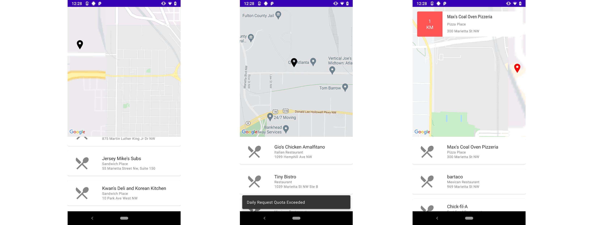
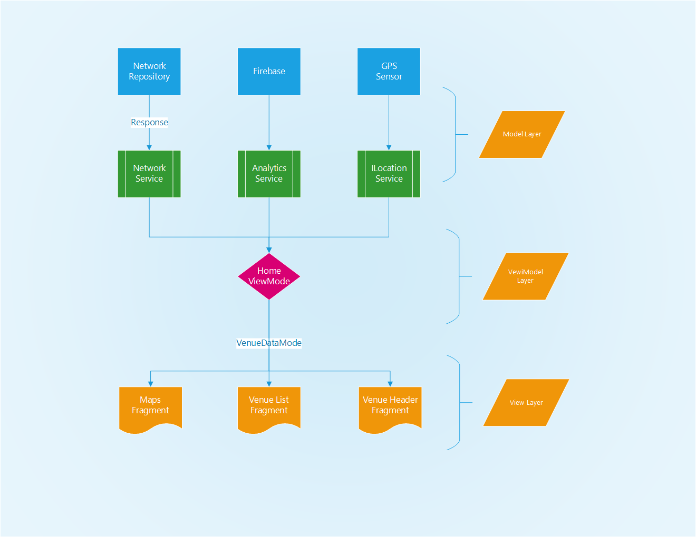

# Popeat

First, I like to point out that I'm very much aware of the `local.properties` file in this repo, and `keystore.jks` and `google-services.json`.

Theses files are usually and correctly should be provided by the CI tool. I provided those for convenience's sake. and I restricted the keys and used free accounts for all of them in case something bad ever happens.

The app is tested via manual test, Firebase's`Robo` test, `junit` tests, `robolectric` tests, and Espresso as an integration test for the main 2 flows.

## Note worthy Challenges

1. Testing Google Maps Fragment Controller was a real pain to do. we have dependencies on various things and it took me a couple of days to work around these dependencies. theses are the `BitmapDescriptor` interface and `CameraUpdateFactory`. I tested the fragment despite these by injecting google maps into the fragment, and manually initiate the `CameraUpdateFactory` services, currently it works.
2. I thought a lot about the images thing. It can be retrieved via multiple endpoints. I choose what suited the UX best in my opinion, which is to display first the recommendations, and then update them when individual requests happen to get the images of these venues. this way, the user doesn't have to wait many requests to see the result, switching rows is efficient using `UtilDiffs`. That said, this puts a big pressure on the Venue Details API which can cause an increasing cost. I advise to make lazy requests just when these venues are in screen, which will reduce the cost dramatically if that's what we are looking for.
3. I have maxed my quota of the Venue Details API, which meant that currently errors showing network requests are quite common, sorry about that, it was maxed during testing :smile:
4. When delegating the testing to the CI I got an error for `Robolectric`. even though testing with Android Studio works. The problem is Hilt and that it's not super compatible with `Robolectric`'s `lauchActivityInContainer` at the moment. I would fix it if I have time by creating a custom `lauchActivityInHiltContainer` but for now I don't have much time. This is why the CI doesn't contain gradle scripts for testing at the moment.

## Result Images

1. Exploration Mode
2. Navigation Mode
3. An Error

Notes:

Images doesn't show because I maxed my quota for the day, sorry.

## Design

I used the material design guidelines from

https://material.io/components/lists#specs

## Architecture

 I used MVVM with one shared `ViewModel`, across multiple fragments, all testes using `Robolectric` and `JUnit5`. When delegating the request to the CI I got an error for `Robolectric`.

I managed to share `ViewModel` state across these subscribers by passing the store owner as an optional dependency

With Love 

Mohammad Al Kalaleeb